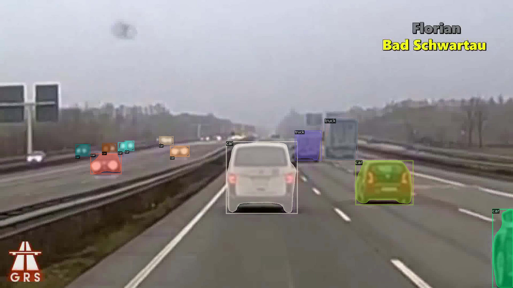

# Object-Tracker

This repo contains a simple object tracker implemented using Detectron2 library. 
This tracker will detect objects on all frames of a video and then will link the predictions from one frame to the next.>br/>
Link to a sample video: https://drive.google.com/file/d/1ScDQDygFJ-72G89AekVuE1IyshJxwQTH/view?usp=sharing
